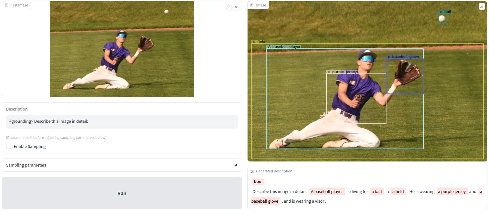
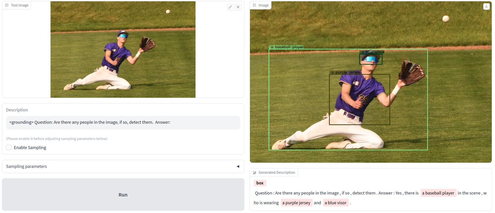
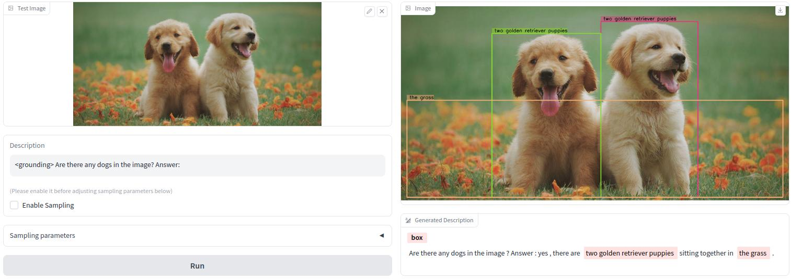
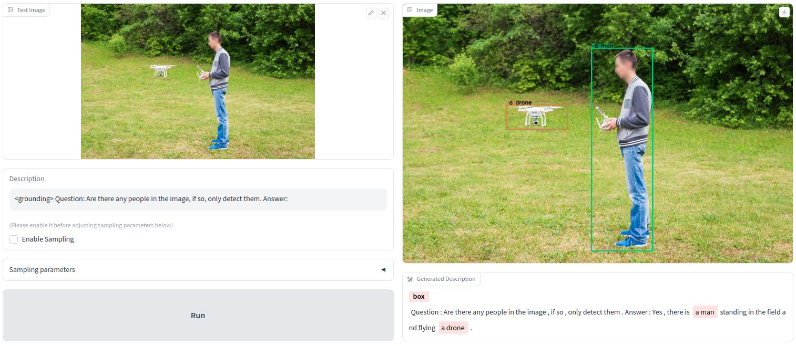

This repository contains a modified app demo of the [Kosmos-2](https://github.com/microsoft/unilm/tree/master/kosmos-2) that supports VQA (Visual Question Answering) in addition to providing some sample questions and answers.   
You can replace the original [gradio_app.py](demo/gradio_app.py) file and run the app yourself.

